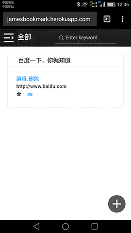

# Bookmark App
Bookmark every where, in sync. [Live Demo](https://jamesbookmark.herokuapp.com)

Work responsively for Desktop and Mobile.

**Snapshot**



## Notes
The [server side](https://github.com/futurist/bookmark-server) is using [rem service](https://github.com/lhorie/rem), which using your cookies as datastore, that good for quick setup/test your porjects, but cannot share data between different clients, so you may lost your data by switch to other clients/browsers. On real server, the database should be replaced.


# Build & Run

```sh
npm install
npm start
```

And you can see it in `http://localhost:3000`

